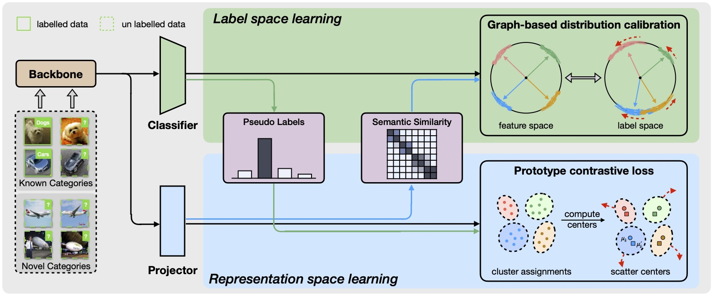
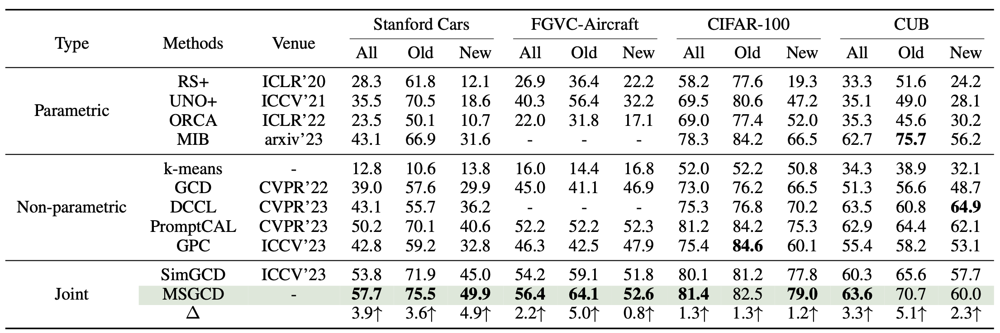

# Mutual-support Generalized Category Discovery

This repo contains code for our paper: [Mutual-support Generalized Category Discovery]().



This work focuses on the problem of Generalized Category Discovery (GCD), a more realistic and challenging semi-supervised learning setting where unlabeled data can be from either previously known or new unseen categories. Recently, both pseudo-label-based parametric classification methods and representation-based non-parametric classification methods have shown impressive performance in addressing this issue. However, there has been no study discussing how to integrate their advantages. To address this, we propose Mutual-Support Generalized Category Discovery (MSGCD), which unifies these two paradigms into a framework and realizes mutual promotion. Specifically, MSGCD builds a Siamese network with two branches to simultaneously learn high-quality pseudo-labels and discriminative representations while introducing a mutual support mechanism to enhance each other. On one hand, high-quality pseudo-labels provide useful weakly supervised information for learning discriminative representations.
On the other hand, discriminative representations enable semantic similarity estimation, guiding the model to generate more reliable pseudo-labels. Moreover, MSGCD is decoupled from existing approaches and can benefit from the advances made in parametric and non-parametric classification methods. For clarity, MSGCD builds upon a simple baseline in this work. Despite its simplicity, we show that MSGCD is highly
effective and achieves state-of-the-art results on multiple datasets. Our code will be released upon paper acceptance.  

## Running

### Dependencies

```
pip install -r requirements.txt
```

### Config

Set paths to datasets and desired log directories in ```config.py```


### Datasets

We use fine-grained benchmarks in this paper, including:

* [CUB-200-2011](http://www.vision.caltech.edu/visipedia-data/CUB-200-2011/CUB_200_2011.tgz)
* Cars-196 ([Img](http://imagenet.stanford.edu/internal/car196/car_ims.tgz), [Annotation](http://imagenet.stanford.edu/internal/car196/cars_annos.mat))
- [FGVC-Aircraft](https://www.robots.ox.ac.uk/~vgg/data/fgvc-aircraft/)


We use generic object recognition datasets, including:

* [CIFAR-10/100](https://pytorch.org/vision/stable/datasets.html)

### Scripts

**Train the model**:

```
bash scripts/run_${DATASET_NAME}.sh
```

## Experimental Restuls
Our results in  four datasets:


## Acknowledgements

The codebase is largely built on this repo: https://github.com/sgvaze/generalized-category-discovery.

## License

This project is licensed under the MIT License - see the [LICENSE](LICENSE) file for details.
